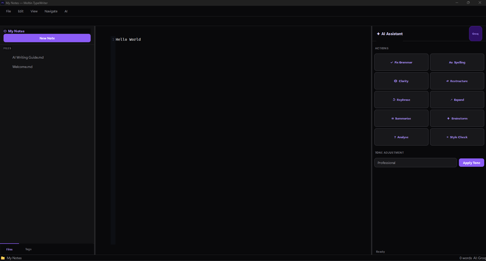

# Moltin TypeWriter ✦

> A modern, AI-powered knowledge management application — your intelligent writing partner.



---

## Features

| Feature | Details |
|---|---|
| **Markdown Editor** | Syntax highlighting, live preview, CodeMirror-class editing |
| **Tabs** | Multiple notes open simultaneously |
| **Wiki Links** | `[[Note Name]]` linking with Ctrl+Click navigation |
| **Backlinks** | See every note that links to the current one |
| **Tags** | `#tag` support with sidebar panel |
| **Full-Text Search** | Fuzzy search across all notes (Ctrl+P / Ctrl+Shift+F) |
| **Graph View** | Interactive force-directed link graph |
| **AI Assistant** | 10+ writing actions powered by Groq (built-in) |
| **Multi-Provider AI** | OpenAI, Claude, Gemini, Ollama support |
| **Dark & Light Theme** | Moltin Dark (default) + Moltin Light |
| **Auto-save** | 1-second debounced save, crash recovery |
| **Windows Installer** | Proper `.exe` installer via Inno Setup |

---

## Quick Start (Development)

### Requirements
- Python 3.11 or later
- pip

### Run from Source

```bash
# 1. Clone / download the project
cd "Moltin TypeWriter"

# 2. Double-click run.bat  OR  run manually:
python -m venv .venv
.venv\Scripts\activate
pip install -r requirements.txt
python main.py
```

---

## Build Windows Installer

### Prerequisites
1. Install **Python 3.11+**
2. Install **[Inno Setup 6](https://jrsoftware.org/isinfo.php)** (for the installer)

### Build

```bash
# Double-click build.bat  OR  run:
python build.py
```

This will:
1. Package the app with **PyInstaller** → `dist/MoltinTypeWriter/`
2. Compile the **Inno Setup** installer → `dist/MoltinTypeWriter-Setup-1.0.0.exe`

The installer:
- Creates `%AppData%\MoltinTypeWriter\` folders (vaults, backups, plugins)
- Creates a **Start Menu** shortcut
- Optionally creates a **Desktop** shortcut
- Installs an uninstaller (your notes are **never deleted** on uninstall)

---

## AI Configuration

Moltin TypeWriter ships with a **built-in Groq API key** — AI works immediately with no setup.

### Change AI Provider

1. Open **File → Settings → AI Providers**
2. Select your preferred provider from the dropdown
3. Paste your API key (stored encrypted with AES-256-GCM)

| Provider | Models | Get Key |
|---|---|---|
| **Groq** (default) | Llama 3.3 70B | [console.groq.com](https://console.groq.com/keys) |
| OpenAI | GPT-4o, GPT-4o-mini | [platform.openai.com](https://platform.openai.com/api-keys) |
| Anthropic | Claude 3.5 Haiku/Sonnet | [console.anthropic.com](https://console.anthropic.com) |
| Google Gemini | Gemini 1.5 Flash | [aistudio.google.com](https://aistudio.google.com) |
| Ollama | Any local model | [ollama.ai](https://ollama.ai) |

---

## Keyboard Shortcuts

| Shortcut | Action |
|---|---|
| `Ctrl+N` | New note |
| `Ctrl+P` | Quick switcher |
| `Ctrl+Shift+F` | Full-text search |
| `Ctrl+S` | Save |
| `Ctrl+W` | Close tab |
| `Ctrl+Tab` | Next tab |
| `Ctrl+Shift+Tab` | Previous tab |
| `Ctrl+\` | Toggle sidebar |
| `Ctrl+Shift+A` | Toggle AI panel |
| `Ctrl+Shift+T` | Toggle theme |
| `Ctrl+Shift+G` | AI: Fix Grammar |
| `Ctrl+Shift+R` | AI: Rephrase |
| `Ctrl+Shift+E` | AI: Expand |
| `Ctrl+Shift+S` | AI: Summarise |
| `Ctrl+B` | Bold |
| `Ctrl+I` | Italic |
| `Ctrl+Click` | Follow wiki link |

---

## AI Actions

Select text, then right-click or use the AI panel:

- **Fix Grammar** — Correct grammar errors
- **Fix Spelling** — Correct spelling mistakes
- **Improve Clarity** — Simplify and clarify
- **Restructure** — Improve logical flow
- **Rephrase** — Different words, same meaning
- **Expand** — Turn a brief idea into a paragraph
- **Summarise** — Condense long text
- **Brainstorm** — Generate related ideas
- **Adjust Tone** — Professional / Casual / Academic / Friendly / Persuasive
- **Analyse** — Get detailed writing feedback with explanations

Every suggestion includes a **"Why this change"** explanation card.

---

## Project Structure

```
Moltin TypeWriter/
├── main.py                 # Application entry point
├── requirements.txt        # Python dependencies
├── build.py                # Build + installer script
├── run.bat                 # Quick start (Windows)
├── build.bat               # Build installer (Windows)
├── config/
│   ├── app_dirs.py         # AppData path management
│   ├── crypto.py           # AES-256-GCM encryption
│   └── settings.py         # Settings persistence
├── services/
│   ├── file_service.py     # File CRUD + indexing
│   ├── search_service.py   # Fuzzy search
│   ├── backlink_service.py # Wiki-link graph
│   └── ai/
│       ├── ai_manager.py   # Provider router
│       ├── prompts.py      # Prompt templates
│       └── providers/      # Groq, OpenAI, Anthropic, Gemini, Ollama
├── ui/
│   ├── main_window.py      # Main application window
│   ├── editor.py           # Markdown editor + highlighter
│   ├── sidebar.py          # File tree + backlinks + tags
│   ├── ai_panel.py         # AI assistant panel
│   ├── tab_manager.py      # Tab management
│   ├── search_modal.py     # Search overlay
│   ├── settings_dialog.py  # Settings UI
│   ├── graph_view.py       # Link graph visualization
│   └── theme.py            # Theme loader
├── styles/
│   ├── dark.qss            # Moltin Dark theme
│   └── light.qss           # Moltin Light theme
├── installer/
│   └── setup.iss           # Inno Setup installer script
└── assets/
    └── icon.ico            # Application icon
```

---

## Data Storage

All notes are stored as standard **Markdown files** in:
```
%AppData%\MoltinTypeWriter\vaults\<vault-name>\
```

You can open your vault folder in any text editor or sync it with any cloud service. **You always own your data.**

---

## License

MIT — see [LICENSE.txt](LICENSE.txt)
